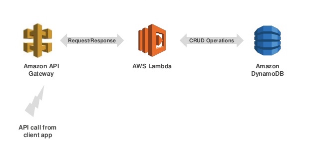

# AWS Startup Kit Serverless Workload

An example serverless application project:  a RESTful API backed by DynamoDB. The architecture is as follows:



More specifically, components include multiple AWS Lambda functions, Amazon API Gateway, and an Amazon DynamoDB table.  The project uses the Lambda Node.js runtime, and generally follows the ECMAScript 6 standard.  The AWS Serverless Application Model (SAM) is used to deploy the project. 

## LAUNCHING THE APP ON AWS

### Prerequisites

- [Install the AWS CLI](http://docs.aws.amazon.com/cli/latest/userguide/installing.html), or update
 the version you have installed previously (some commands used here may not
 exist in older versions of the AWS CLI).

- [Create an IAM user with admin access](http://docs.aws.amazon.com/IAM/latest/UserGuide/getting-started_create-admin-group.html).
 The IAM user you associate with the AWS CLI should have admin permissions, including the ability to create IAM roles.

- [Configure the AWS CLI to use the admin user](http://docs.aws.amazon.com/cli/latest/reference/configure/)


To begin your deployment, either download a zip file of the code from GitHub (via the green button above), or clone the GitHub repository with the command:  

```

  git clone https://github.com/aws-samples/startup-kit-serverless-workload.git

```


### Deployment Via Installation Script

You can use the installation script to deploy the app, or continue to the manual deployment section below to gain insight regarding what's happening under the hood.

The installation script (install.sh) is in the code you downloaded or cloned from this GitHub repository. First make sure you can execute the script. Using the command line, grant execution permissions for the script file by running the following command:

```
   
   chmod +x install.sh

```

Then you can run the installation script:

```
   
   ./install.sh

```

That's it!  Your Startup Kit Serverless Workload is now fully deployed and ready to be tested.  To test it, try the curl commands output by the installation script. See the **TESTING AND CORS** section below for further testing options and CORS details.  


### Manual Deployment

To understand the steps involved in an AWS SAM deployment, deploy the workload
manually.  Once you have a S3 bucket in place to hold deployment artifacts, the 
workflow for using AWS SAM primarily consists of using just two AWS CLI commands.  

In the AWS Region where you plan to do your deployment, be sure you have an 
existing Amazon S3 bucket in which SAM can put the deployment artifacts, or 
create a new bucket using the following AWS CLI command:  

```

  aws s3 mb s3://<your-bucket-name>.  
  
```

Next, to deploy the project for the first time with SAM, and for each subsequent 
code update, run both of the following AWS CLI commands in order.  For the 
first command, package, replace the s3-bucket argument with the name of your 
S3 bucket.  For the second command, deploy, replace the template-file argument 
with the full path to your output template file.

```

aws cloudformation package \
--template-file serverless.cfn.yml \
--output-template-file serverless-xfm.cfn.yml \
--s3-bucket <your-bucket-name>

aws cloudformation deploy \
--template-file <path-to-file/serverless-xfm.cfn.yml> \
--stack-name StartupKitServerless \
--capabilities CAPABILITY_IAM

```


### AWS Cloud9

When you are working with a non-sample serverless application, you might consider using AWS Cloud9 to help manage your serverless application project. Cloud9 is a cloud-based integrated development environment (IDE) that lets you write, run, and debug your code with just a browser. It has the AWS CLI pre-installed so you don’t need to install files or configure your laptop to use the AWS CLI. You can use Cloud9 to work with AWS Lambda functions and their related Amazon API Gateway APIs in a Cloud9 development environment. It enables easy local testing of Lambda functions as well as one-click remote deployment of Lambda functions. For more details, see https://docs.aws.amazon.com/cloud9/latest/user-guide/lambda-functions.html.


## TESTING AND CORS

### Testing From the Command Line

First get the invoke URL of your API. If you did not use the installation script, do this by going to the API Gateway console, selecting the StartupKitServerless API, then **Stages** in the left navigation panel, and finally **Stage** in the list of stages.  The invoke URL should now appear at the top of the right hand panel.  

Begin testing by adding some TODO items using the create API.  This may be
accomplished using the following command: 

```

   curl -X POST -H 'Content-Type: application/json' -d '{"todo_id": "1001", "active": true, "description": "What TODO next?"}' https://<invoke-URL-for-your-API>/todo/new
   
```

To fetch the active TODO items you created, execute the following command:

```

   curl https://<invoke-URL-for-your-API>/todo/active

```

Similar commands can be used to test all of the other API calls.


### Testing From A Front End With CORS Enbabled

Without CORS enabled, the API should work fine with a mobile client such as iOS or Android. The API also should work when called from a server. However, unless CORS is enabled, the API will not work with a web front end due to CORS. 

By default, CORS is enabled for this project. This involves two files:  serverless.cfn.yml, and the source code file index.js.  In serverless.cfn.yml, the Globals section has a **Cors** property under **Api** to enable CORS.  In index.js, the **createResponse** function returns an Access-Control-Allow-Origin header. To disable CORS, remove this code. If you retain CORS enablement for a real world project, it is a best practice to replace the domain name-related wildcards in both files with a specific domain name.  


## CLEAN UP

If you do not need to retain the workload created by this project, you can delete the resources associated with it.  To do so, go to the AWS console and select the **AWS CloudFormation** service from the list of AWS services.  Inside the CloudFormation console, examine the table of stacks.  Find the stack named ```StartupKitServerlessWorkload```, click the check box next to it, then select **Delete Stack** from the **Actions** drop down menu above the stack table.


